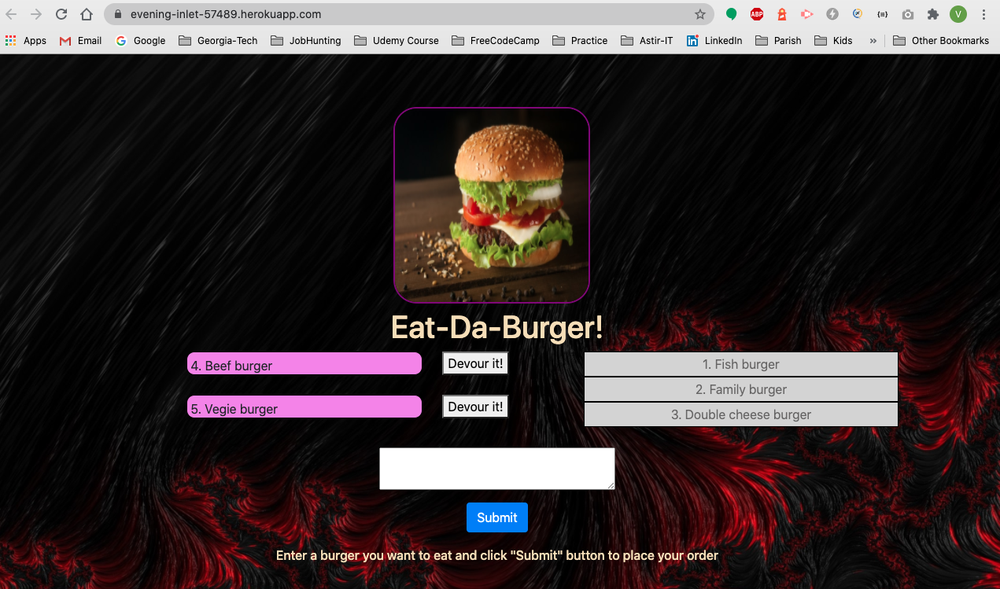

# Eat-Da-Burger Application

## Table of Contents

* [Installation](#installation)
* [Usage](#usage)
* [Credits](#credits)
* [URL](#url)
* [License](#mit_license)

## Installation

1. Clone the repo.
2. Insert your password into sql connection.
3. Run shema.sql file in MySQL Workbench.
4. Run npm install command in your terminal/bash.
5. Then run node app.js command in your terminal/bash.

## Usage

This Eat-Da-Burger  WEB Application provides opportunity to place orders and to track completed oreders using MySQL database.  

The following screenshot demonstrates the application functionality:

## Credits

This was a solo project comlepeted by Volodymyr Petrytsya as homework for the Georgia Tech, FullStack Flex program.

## URL

[Link to the deployed Eat-Da-Burger Application](https://evening-inlet-57489.herokuapp.com/)

## MIT_License 

Copyright (c) [2020] [Volodymyr Petrytsya]

Permission is hereby granted, free of charge, to any person obtaining a copy
of this software and associated documentation files (the "Software"), to deal
in the Software without restriction, including without limitation the rights
to use, copy, modify, merge, publish, distribute, sublicense, and/or sell
copies of the Software, and to permit persons to whom the Software is
furnished to do so, subject to the following conditions:

The above copyright notice and this permission notice shall be included in all
copies or substantial portions of the Software.

THE SOFTWARE IS PROVIDED "AS IS", WITHOUT WARRANTY OF ANY KIND, EXPRESS OR
IMPLIED, INCLUDING BUT NOT LIMITED TO THE WARRANTIES OF MERCHANTABILITY,
FITNESS FOR A PARTICULAR PURPOSE AND NONINFRINGEMENT. IN NO EVENT SHALL THE
AUTHORS OR COPYRIGHT HOLDERS BE LIABLE FOR ANY CLAIM, DAMAGES OR OTHER
LIABILITY, WHETHER IN AN ACTION OF CONTRACT, TORT OR OTHERWISE, ARISING FROM,
OUT OF OR IN CONNECTION WITH THE SOFTWARE OR THE USE OR OTHER DEALINGS IN THE
SOFTWARE.

 <!-- ## Contributing

If you would like to contribute to this project, please follow the [Contributor Covenant](https://www.contributor-covenant.org/) guidelines.  -->

